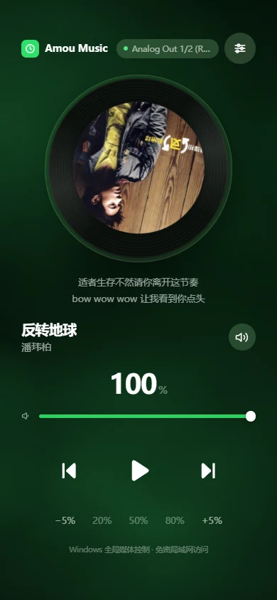
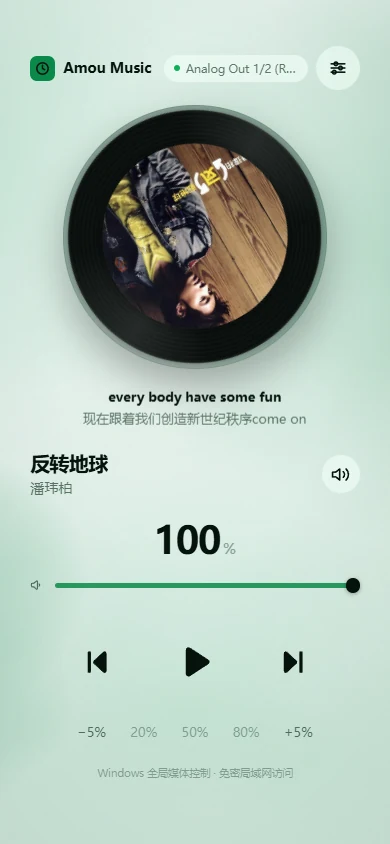
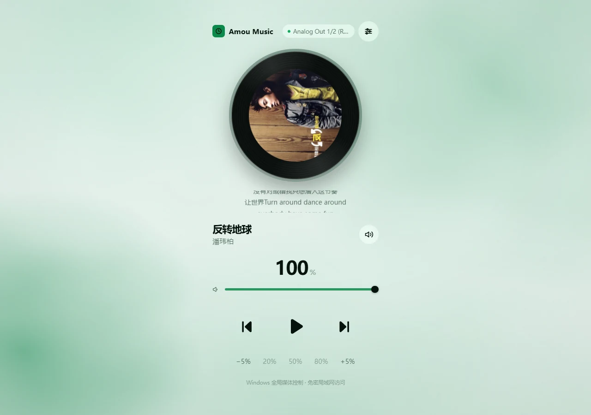
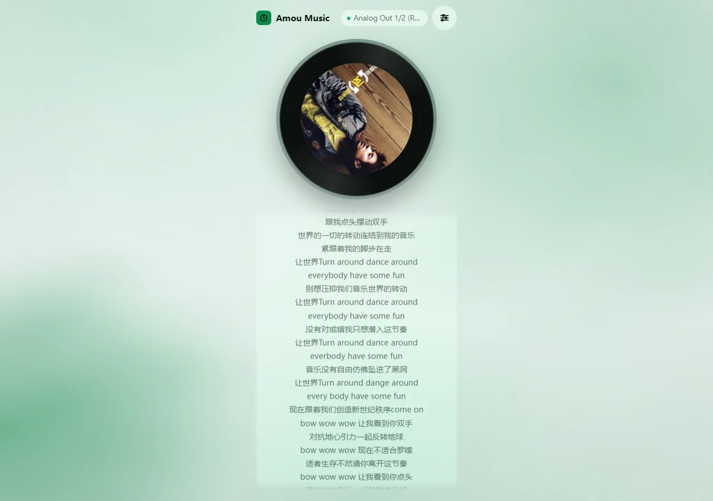
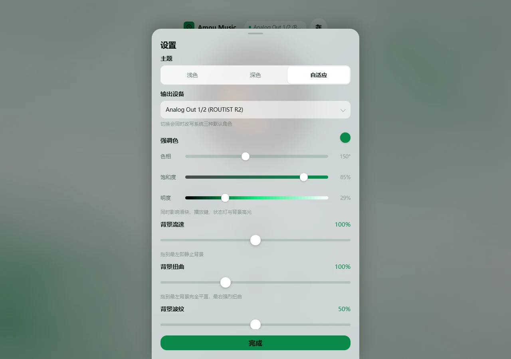

# Amou Music · 局域网播放遥控器

> **本项目的全部代码由 AI 编码代理生成，没有一行是人写的。**设计决策由人做，实现由 AI 落地，验证脚本与文档同样是。欢迎带着怀疑来读。

**Windows 独占**。在手机、平板或同一 WiFi 下的任意设备上，用浏览器控制这台电脑的**系统媒体会话**和**主输出音量**。
零 Web 框架，前端全部内嵌在一个 html 里，不引用任何 CDN。

网易云、QQ 音乐、Spotify、浏览器播的视频……只要它在播，遥控器就能控制它——因为走的是 Windows 全局媒体键，而不是绑定某个播放器。

> **运行前请先读这一段。** 本服务**没有任何访问密码**，默认监听 `0.0.0.0`（所有网卡），使用未加密的 HTTP。
> **任何能访问这台机器的人，都能改你的音量、静音、输出设备和媒体键。**
> 屏幕上、工作室、供应商网络这类场合下请不要开。只想自己用，启动时加 `--host 127.0.0.1` 就只能本机访问。
> 更多见 [SECURITY.md](.github/SECURITY.md)。

  
  &nbsp;&nbsp;
  

---

## 快速开始

需要 Windows 与 Python 3.14。双击 `start.bat`，首次运行会自动建虚拟环境、装依赖，接着就启动。
控制台会打印一个地址，手机连同一个 WiFi 就能访问。

停止：控制台窗口里按 `Ctrl+C`。换端口：`start.bat --port 9000`。

手机连不上的话，是因为 Windows 防火墙默认放行。以管理员身份运行 `start.bat`
会自动加一条入站放行规则；普通权限运行则会在控制台打印一条可直接执行的命令。
想撤销：`netsh advfirewall firewall delete rule name="Amou Music Remote"`。

---

  

## 能做什么

| 操作 | 说明 |
| --- | --- |
| 播放 / 暂停 | Windows 全局媒体键 `0xB3` |
| 曲名 / 歌手 / 专辑 | 网易云本地缓存（只读） |
| 封面 | `GET /api/cover?song_id=`，按曲目缓存 |
| 歌词 | 网易云本地缓存，两行窗口（当前行 + 下一行） |
| 上一首 / 下一首 | 全局媒体键 `0xB1` / `0xB0` |
| 音量调节 | 直接读写系统默认输出设备的音量，精确到 1% |
| 静音 | 读取真实静音状态，不是自己记的开关 |

音量滑块支持拖动，页面每 2 秒跟 PC 侧同步一次，所以在电脑上改音量，手机上的数字也会跟着变。

## 已知边界

**只支持网易云音乐。** 曲名、歌手、专辑、封面、歌词读的是网易云的**本地缓存**
（`Library/webdb.dat` / `Statics/index.dat` / `Temp/index.dat`，只读打开）。三个都是私有格式，
网易云升级后可能失效；失效时界面退回「全局系统音频会话」，**音量与播放控制不受影响**。
接入其他播放器是 `metadata.py` 的 `MetadataSource` 加一个子类，`device.py` 不用改。

**播放位置是估算的。** 本地没有位置源，位置由播放起始时间推算：暂停冻结、恢复续算。
**拖动进度条会造成漂移且无法自愈**，直到下次切歌。歌词高亮基于此值。

**切歌后有 5 秒沿用上一首歌词。** 归属没法用时间戳 join（缓存表的 `time` 与播放记录
相差 7.3-8.0 小时且偏移不固定），只能靠条目变更检测 + 5 秒宽限。宽限期内沿用旧词是为了不闪；
宽限一满即恒空，**不会回弹**。迟到的歌词由条目变更接住。

**歌词固定两行**（正在唱的和下一行），**长按歌词卡可展开全曲**。

  
  &nbsp;&nbsp;
  

**播放状态图标只认白名单里的播放器。** 控制走全局媒体键，任何播放器都按得动；
但音频会话图是**全机器**的——语音助手、模拟器、游戏只要有一个在发声，早期实现会把图标永久锁在「暂停」。
现在只统计白名单进程（网易云、QQ 音乐、VLC、Spotify 等）。**加播放器只需在 `device.py` 的 `_MEDIA_PROCESSES` 里加一行进程名。**
漏加的后果是该播放器对遥控器不可见，不会让按钮显示错。

**播放状态有几秒延迟。** 音频会话图不是即时的：实测暂停网易云后，会话对象要约 5 秒才消失。
前端做了双向去抖——连续两次读数一致才跟随，且按下时立即响应。

**卡片跟着网易云的存活走。** 网易云进程不在，卡片就清掉，与「有没有在出声」无关。
暂停时播放器自己的封面还亮着，遥控器与之保持一致。

**没有媒体在播时**，按播放键 Windows 可能会改为启动你设置的默认音乐应用。这是系统行为。

**音量只作用于系统默认输出设备**，不支持在多台设备间切换。

**没有访问密码**（见文开头的警告）。

**为什么不用 SMTC**：标准做法是读 Windows 的 SystemMediaTransportControls，但这台机器的 WinRT
运行时组件残缺——拿 `Calendar`、`ApplicationData` 这类**必然存在**的类做对照实验，`RoGetActivationFactory`
同样全部失败。所以这不是缺依赖库，装任何包都救不回来。

> 为什么开发时要同时改 `max-width` 和 `--chrome`、为什么高光必须是两段对称的、
> 为什么 CSS 关键帧会把 GSAP 写进去的表现直接覆盖掉——这类「不报错的坑」在
> [CONTRIBUTING.md](.github/CONTRIBUTING.md) 里。

---

## 结构

    server.py / device.py / metadata.py   HTTP 层 · 设备层（COM）· 元数据适配层
    web/index.html                        前端全部内嵌，无构建步骤，不引用 CDN
    tools/                                验证脚本（下一节）

## 验证

    pwsh -File tools/verify-api.ps1      # 16 项，秒级，先跑这个
    python tools/verify-lyrics.py        #  2 项，状态机重放
    pwsh -File tools/verify-disc.ps1     # 34 项，需要 Playwright CLI

三者分开取：接口能不能用、状态机有没有退化、画面对不对。CI 只跑第二个
（无声卡的 runner 启不了服务）。它们为什么是这个样子、每条断言被改坏过多少次，
见 [CONTRIBUTING.md](.github/CONTRIBUTING.md)。

## 参与开发

很想有人接手。**[先读这份](.github/CONTRIBUTING.md)**——里面列了项目里一组
「看起来能独立改、其实依赖其他东西」的不变量：高度预算是两个必须成对改的系数、
唱片与圆形毛玻璃的比例有上界、一个属性只能有一个写入者（CSS 关键帧会盖掉
GSAP 写的内联值）。这些东西**一个都不报错**，只是等你哪天顺手改了就静默坏掉，
而且坏得看不出原因。

提交 PR 前请把上面三个验证都跑一遍，它们分别对应「画面对不对」「能不能用」
和「状态机有没有退化」三类失败。

一个请求：**贡献说明里写理由，不是只写你改了什么。** 对上面那些不变量，
真正有意思的部分永远是「为什么想当然的那个版本不对」。

## 许可证

MIT，见 [LICENSE](LICENSE)。

`web/gsap.min.js` 是 vendor 进来的 GSAP 3.15.0，**不在 MIT 覆盖范围内**，
仍属于 GreenSock 自己的许可，声明随那个文件一起分发。
